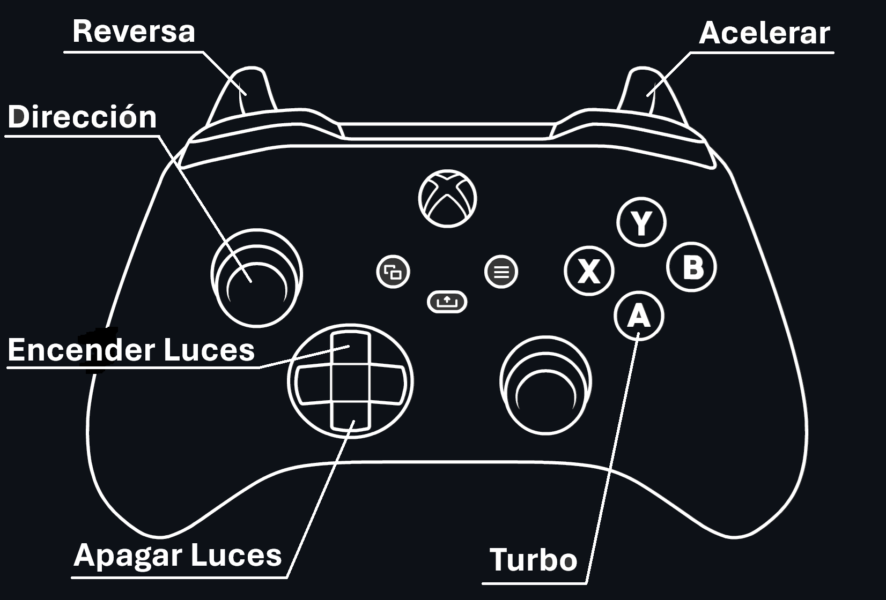

# Control Shell Motorsport 2024

Aplicación escrita en Python para controlar los autos de la colección “Shell Motorsport” vendidos en Argentina en 2024.

## Guía de inicio rápido

- Descargar el ejecutable de la aplicación en la página de ["Releases"](https://github.com/tdominguez33/shell-motorsport-control/releases/latest) (recomendado) o el código desde [GitHub](https://github.com/tdominguez33/shell-motorsport-control/archive/refs/heads/main.zip).
- Extraer el archivo descargado.

- Conectar un control a la PC, este debe ser **X-INPUT**, es decir, un control de estilo **Xbox**, los controles de PlayStation (Dualshock 3 y 4, Dualsense) no funcionan sin un programa externo que haga las conversiones.
- Encender el auto.
- Abrir el ejecutable **shellMotorsport.exe**
- Si se quiere ejecutar desde el código se deben instalar las dependencias del proyecto con ```pip install -r requirements.txt``` y luego ejecutar el archivo principal con el comando ```python shellMotorsport.py```
- Esperar a que el programa encuentre el auto y se conecte.
- **Jugar!**

## Controles

**Nota:** El botón de turbo debe mantenerse apretado para que esté activo, no funciona como el de la aplicación original.

## Configuraciones
#### Conexión a un auto específico
Se puede especificar al programa que se conecte a un auto específico, por si se quieren conectar dos autos al mismo tiempo y se quiere garantizar siempre controlar al mismo. Los pasos son:
- Obtener el nombre Bluetooth del auto. Este se puede obtener con cualquier celular o PC con Bluetooth, se enciende el auto y se escanea como con cualquier dispositivo, el nombre tiene el formato: **“QCAR-XXXXXX”**, donde las X son números y letras aleatorios.
- Con el nombre, se abre el archivo [config.ini](./config.ini) y se cambia el valor de la configuración **"conexion_especifica"** por un **1** y luego se reemplaza la configuración de **"nombre"** por nuestro nombre obtenido, luego guardar el archivo. Con esto ya queda configurado en el programa, cada vez que se abra el programa buscará siempre el mismo auto.
